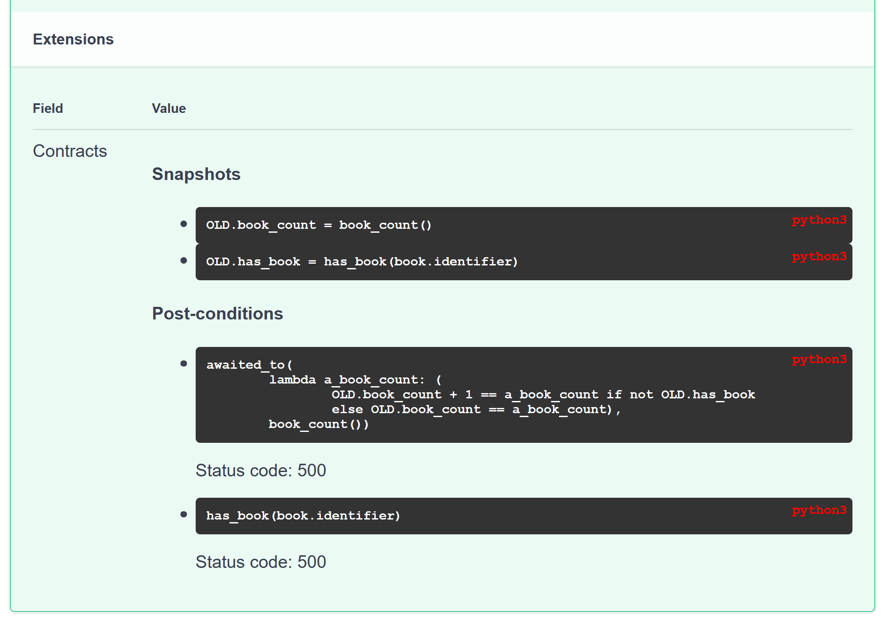

# Swagger-ui-plugin-contracts

[](
https://github.com/mristin/swagger-ui-plugin-contracts/actions/workflows/check-push-to-main.yml
)

[](
https://www.npmjs.com/package/swagger-ui-plugin-contracts
)

This is a [Swagger UI] plugin which renders the [contracts] of your operations (`x-contracts`).

[Swagger UI]: https://swagger.io/tools/swagger-ui/
[contracts]: https://en.wikipedia.org/wiki/Design_by_contract



# Usage

There are two ways to include the plugin in Swagger UI: *via* `npm` and *via* `unpkg`.

## Via `npm`

Install the module with npm:

```
npm install --save swagger-ui-plugin-contracts
```

Require it in your client-side application:

```javascript
const ContractsPlugin = require('swagger-ui-plugin-contracts');

const ui = SwaggerUI({
  // your options here...
  plugins: [
    // other plugins...
    ContractsPlugin
  ]
})
```

## Via `unpkg`

Specify the plugin in your HTML page and load it through [unpkg]:

```html
<script>
<!-- Load Swagger UI -->
<script src="https://unpkg.com/swagger-ui-dist/swagger-ui-bundle.js"></script> 
<!-- Load the PrettyJSONViewPlugin -->
<script src="https://unpkg.com/swagger-ui-plugin-contracts"></script>

<script>
window.onload = function() {
  SwaggerUI({
    // your options here...
    plugins: [
      // other plugins...
      ContractsPlugin
    ]
  })
}
</script>
```

[unpkg]: https://unpkg.com/

# Contracts

The contracts are specified as the extension `x-contracts` for each operation.
The contracts consist of:
* `preconditions`, a list of pre-conditions that need to hold *before* the execution,
* `snapshots`, a list of snapshots of "old" values which are captured *before* the execution, and
* `postconditions`, a list of post-conditions that need to hold *after* the execution.

## Condition

The `preconditions` and `postconditions` are defined as objects:

```
{
  "enforced": boolean,
  "text": string,
  "language": string,
  "statusCode": integer
}
```

**`enforced`**. 
If the condition is enforced, it means that the server will indeed check it on each request.
Otherwise, the condition is merely documented, but will not be executed during a request.

Unenforced conditions are still an important piece of documentation!
For example, they help the client to understand formally the request logic and what inputs or 
outputs are expected.
Though the condition is not enforced in production, the client can still assume that the condition
was at least executed during, *e.g.*, testing.

**`text`**.
Formal definition of the condition. 
For example, the source code in the backend's language.

**`language`**. 
The language in which the condition (`text`) was formulated.
Usually the programming language of the backend.

**`statusCode`**.
The status code set in the response if the condition is violated.

### Example

Here is an example of a post-condition:

```json
{
  "enforced": true,
  "text": "has_book(book.identifier)",
  "language": "python3",
  "statusCode": 500
}
```

## Snapshot

The `snapshots` are defined as objects:

```
{
  "name": string,
  "enabled": boolean,
  "text": string,
  "language": string
}
```

**`name`**. 
The name of the snapshot which identifies how the "old" value will be referenced.

**`enabled`**.
If enabled, the snapshot is captured at every request.
Otherwise, the snapshot is only documented in the schema, but it is not captured.
A disabled snapshot is still useful for the reader so that she can follow the logic of (analogously)
unenforced post-conditions using the values of disabled snapshots.

**`text`**.
Formal definition of a snapshot.
For example, the source code in the backend's language.

**`language`**. 
The language in which the snapshot (`text`) was formulated.
Usually the programming language of the backend.

### Example

Here is an example of a snapshot:

```json
{
  "name": "book_count",
  "enabled": true,
  "text": "book_count()",
  "language": "python3"
}
```

## Full Example

Here is an example of a schema that specifies contracts. 
The irrelevant parts have been omitted for readability.

(The complete schema can be viewed at [manual_test/openapi.json].)

[manual_test/openapi.json]: manual_test/openapi.json 

```json
{
  "paths": {
    "/upsert_book": {
      "post": {
        "operationId": "add_book_upsert_book_post",
        "x-contracts": {
          "preconditions": [],
          "snapshots": [
            {
              "name": "book_count",
              "enabled": true,
              "text": "book_count()",
              "language": "python3"
            },
            {
              "name": "has_book",
              "enabled": true,
              "text": "has_book(book.identifier)",
              "language": "python3"
            }
          ],
          "postconditions": [
            {
              "enforced": true,
              "text": "awaited_to(\n        lambda a_book_count: (\n                OLD.book_count + 1 == a_book_count if not OLD.has_book\n                else OLD.book_count == a_book_count),\n        book_count())",
              "language": "python3",
              "statusCode": 500
            },
            {
              "enforced": true,
              "text": "has_book(book.identifier)",
              "language": "python3",
              "statusCode": 500
            }
          ]
        }
      }
    }
  }
}
```

## Who Uses It?

We developed this plugin to be used in conjunction with [fastapi-icontract], a [FastAPI] extension
for defining [icontracts] for the endpoints.

Please let us know (*e.g.*, by creating a [new issue]) if you use the plugin so that we can list it
here!

[fastapi-icontract]: https://github.com/mristin/fastapi-icontract
[FastAPI]: https://fastapi.tiangolo.com/
[icontracts]: https://github.com/Parquery/icontract
[new issue]: https://github.com/mristin/swagger-ui-plugin-contracts/issues/new

## How Can You Contribute?

Feature requests and bug reports are highly welcome!
Please create a [new issue].

If you want to contribute in code, please see the [contributing guidelines].

[contributing guidelines]: CONTRIBUTING.md
